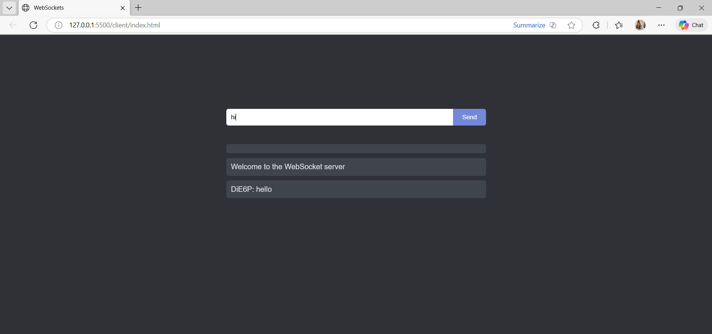
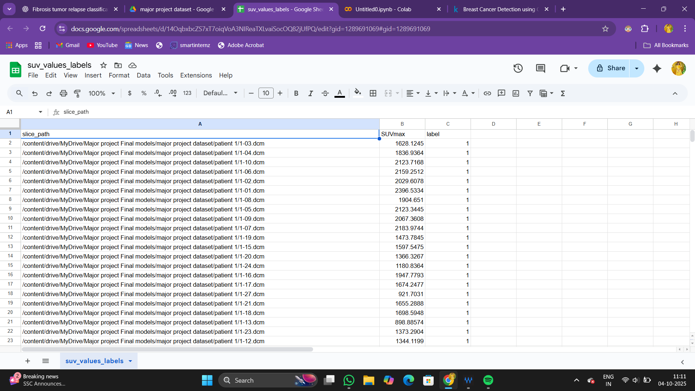
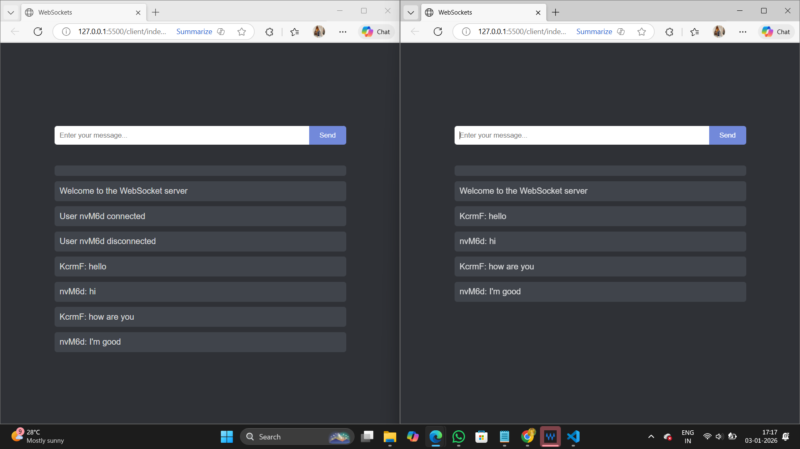

# Real-Time Chat Application (Socket.IO)

A real-time chat application built using **Node.js, Express, and Socket.IO**.
Includes live messaging and a typing indicator feature.

## Features
- Real-time messaging
- Typing indicator
- Multiple users support
- WebSocket communication

## Tech Stack
- Node.js
- Express
- Socket.IO
- HTML, CSS, JavaScript

## Screenshots

### Chat Interface


### Typing Indicator


### Multiple Users Chat


## Installation


### Server
```bash
cd server
npm install
node index.js
